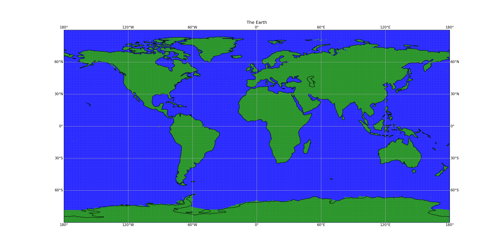

[](https://crates.io/crates/roaring-landmask)
[](https://docs.rs/roaring-landmask/)
[](https://pypi.org/project/roaring-landmask/)
[](https://github.com/gauteh/roaring-landmask/actions)

# The Roaring Landmask

Have you ever needed to know whether you are in the ocean or on land? And you
need to know it fast? And you need to know it without using too much memory or
too much disk? Then try the _Roaring Landmask_!

The _roaring landmask_ is a Rust + Python package for quickly determining
whether a point given in latitude and longitude is on land or not. A landmask
is stored in a tree of [Roaring Bitmaps](https://roaringbitmap.org/). Points
close to the shore might still be in the ocean, so a positive
value is then checked against the vector shapes of the coastline.



([source](https://github.com/gauteh/roaring-landmask/blob/main/src/devel/make_demo_plot.py))


The landmask is generated from the [GSHHG shoreline
database](https://www.soest.hawaii.edu/pwessel/gshhg/) (Wessel, P., and W. H.
F. Smith, A Global Self-consistent, Hierarchical, High-resolution Shoreline
Database, J. Geophys. Res., 101, 8741-8743, 1996).

An alternative is the
[opendrift-landmask-data](https://github.com/OpenDrift/opendrift-landmask-data),
which is slightly faster, is pure Python, but requires more memory and disk
space (memory-mapped 3.7Gb).

## Performance

Microbenchmarks:

```
test tests::test_contains_in_ocean         ... bench:          24 ns/iter (+/- 0)
test tests::test_contains_on_land          ... bench:       3,795 ns/iter (+/- 214)
```

Many points, through Python:

```
------------------------------------------------------------------------------------------------------ benchmark: 5 tests -----------------------------------------------------------------------------------------------------
Name (time in us)                       Min                     Max                    Mean                StdDev                  Median                   IQR            Outliers           OPS            Rounds  Iterations
-------------------------------------------------------------------------------------------------------------------------------------------------------------------------------------------------------------------------------
test_landmask_many_par          34,335.6220 (>1000.0)   39,922.9660 (>1000.0)   36,167.6438 (>1000.0)  1,602.6359 (>1000.0)   35,658.2270 (>1000.0)  1,722.6990 (>1000.0)       9;1       27.6490 (0.00)         30           1
test_landmask_many             130,760.1480 (>1000.0)  131,155.3400 (>1000.0)  130,863.7110 (>1000.0)    137.1064 (598.03)   130,809.7410 (>1000.0)    135.3770 (>1000.0)       1;1        7.6415 (0.00)          8           1
-------------------------------------------------------------------------------------------------------------------------------------------------------------------------------------------------------------------------------
```

The parallel version is significantly faster, while the sequential version is
slightly slower than the equivalent benchmark in `opendrift-landmask-data`,
which uses about `120 ms`.

## Usage from Python

```python
from roaring_landmask import RoaringLandmask

l = RoaringLandmask.new()
x = np.arange(-180, 180, .5)
y = np.arange(-90, 90, .5)

xx, yy = np.meshgrid(x,y)

print ("points:", len(xx.ravel()))
on_land = l.contains_many(xx.ravel(), yy.ravel())
```

## Building & installing

Pre-built wheels are available on PyPI:

1) `pip install roaring-landmask`

To build from source, you can use pip:

1) `pip install .`

or maturin:

1) Install [maturin](https://github.com/PyO3/maturin).

2) Build and install

```
maturin build --release
pip install target/wheels/... # choose your whl
```

